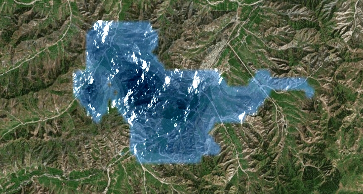

# introduce
This project focuses on water surface rendering, enhancing it based on Cesium. It aims to achieve custom water surface shapes and implement the effect of deeper water appearing darker in color.
If you have many png format photos, you can animate them.

# apply token 
1. Register or log in to a Cesium ion account.
2. Generate an API token and configure permissions.
3. Copy the generated token and use it in this project.

# install
download this project

```git clone https://github.com/dzmjs/CesiumRenderWaterWithDeep.git```

Open `index.html`, find the code `Cesium.Ion.defaultAccessToken` and replace it with your token.


run http server on dir of project:

```python -m http.server <portNumber>```

open url `http://127.0.0.1:<portNumber>/index.html`



# you need to know
Cesium basic programming, photo RGBA, GLSL basic, DEBUG on chrome

# more information on blog
 https://blog.csdn.net/a105411/article/details/139684359

